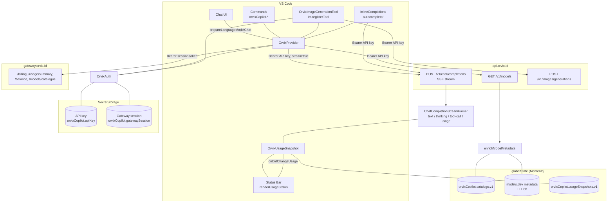

# Development and releases

## Local development

Use Node.js 22 or newer and the committed npm lockfile.

```sh
npm ci
npm run check
npm run package
```

Press F5 with the repository launch configuration to open an Extension Development Host. Add an Orvix provider entry from Copilot Chat's model management UI and use a project-scoped key with `ai:invoke`.

## Architecture



Key properties:

- Two credential principals: an API key (`orv-sk_live_…`) for inference and a browser gateway session for billing/usage only. Both live only in `SecretStorage`.
- The live `/models` response is authoritative for that key and persisted per credential; cached or fallback models are served when a refresh fails.
- Streaming is incremental: chunks become text, thinking, and tool-call progress events, and usage is captured into the snapshot that feeds the status bar.
- Retries are pre-stream only, on network errors and HTTP 502/503/504, and never retry cancellation or a started stream.

## Provider invariants

- Use `https://api.orvix.id/v1` with the extension's own user agent.
- Treat a successful live `/models` response as authoritative for that key.
- Do not send undocumented reasoning controls or guess model prices.
- Retry only network errors and HTTP 502/503/504 before response streaming begins.
- Never retry cancellation, a started stream, 402 funding errors, 403 funding restrictions, or 429 key limits.
- Keep prompts, tool arguments, responses, and keys out of logs and fixtures.

## Release flow

User-visible changes require a Changeset. The release workflow creates a version PR, runs the complete package check, publishes the VSIX to the Visual Studio Marketplace, and creates a matching GitHub release.

## Sources

- [Orvix API documentation](https://docs.orvix.id/)
- [Orvix full LLM documentation](https://docs.orvix.id/llms-full.txt)
- [Orvix API Keys](https://platform.orvix.id/api-keys)
