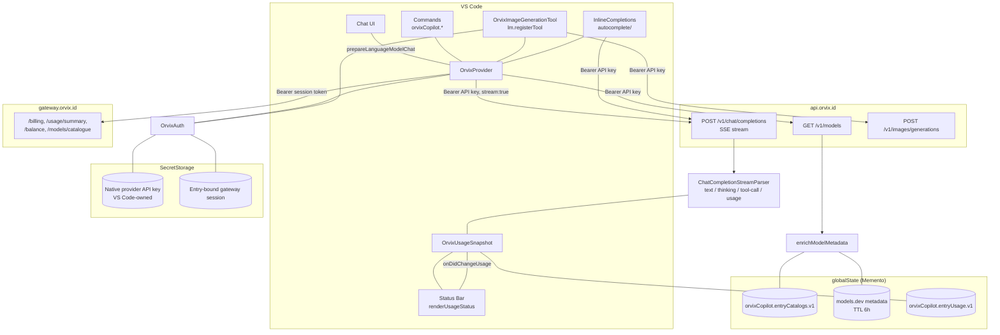

# Development and releases

## Local development

Use Node.js 22 or newer and the committed npm lockfile.

```sh
npm ci
npm run check
npm run package
```

Press F5 with the repository launch configuration to open an Extension Development Host. Add an Orvix provider entry with a unique `entryId` and a project-scoped key with `ai:invoke`.

`test/native/index.js` exports `run()` for a VS Code extension-test host. It uses actual response parts and cancellation with injected synthetic HTTP and keys, checking parallel tools, follow-up history, credential rotation/removal, independent inline/image selections, billing ownership, and stream cleanup. It changes and restores only the three Orvix entry selectors in the isolated host. These tests do not prove live paid inference or billing.

## Architecture


```mermaid
flowchart TD
  subgraph VSCODE["VS Code"]
    UI[Chat UI] ---|prepareLanguageModelChat| PROV[OrvixProvider]
    CMD[Commands<br/>orvixCopilot.*] --- PROV
    TOOL[OrvixImageGenerationTool<br/>lm.registerTool] --- PROV
    INLINE[InlineCompletions<br/>autocomplete/] --- PROV
    SB[Status Bar<br/>renderUsageStatus] ---|onDidChangeUsage| SNAP[OrvixUsageSnapshot]
  end

  subgraph SECRET["SecretStorage"]
    KEY[(Native provider API key<br/>VS Code-owned)]
    GW[(Entry-bound gateway session)]
  end

  subgraph STATE["globalState (Memento)"]
    CAT[(orvixCopilot.entryCatalogs.v1)]
    DEV[(models.dev metadata<br/>TTL 6h)]
    USAGE[(orvixCopilot.entryUsage.v1)]
  end

  subgraph ORVIX["api.orvix.id"]
    MODELS["GET /v1/models"]
    CHAT["POST /v1/chat/completions<br/>SSE stream"]
    IMG["POST /v1/images/generations"]
  end

  subgraph GATEWAY["gateway.orvix.id"]
    BILLING["/billing, /usage/summary,<br/>/balance, /models/catalogue"]
  end

  AUTH[OrvixAuth]
  PROV --- AUTH
  AUTH --- KEY
  AUTH --- GW
  TOOL --- AUTH

  PROV -->|"Bearer API key"| MODELS
  PROV -->|"Bearer API key, stream:true"| CHAT
  TOOL -->|"Bearer API key"| IMG
  INLINE -->|"Bearer API key"| CHAT
  PROV -->|"Bearer session token"| BILLING

  MODELS --> ENRICH["enrichModelMetadata"]
  ENRICH --- DEV
  ENRICH --- CAT

  CHAT --> PARSE["ChatCompletionStreamParser<br/>text / thinking / tool-call / usage"]
  PARSE --- SNAP
  SNAP --- USAGE
  SNAP --- SB
```

Key properties:

- Two credential principals: an API key (`orv-sk_live_…`) for inference and a browser gateway session for billing/usage only. VS Code owns native inference keys; explicitly bound browser sessions live in `SecretStorage`.
- The live `/models` response, including an empty directory, is authoritative for that entry and persisted per credential. Cached or fallback models are served only when a refresh fails.
- Streaming is incremental. A request-scoped reporter emits thinking before text, closes it before tools and at every terminal path, and assigns distinct fallback call IDs. The SSE parser joins indexed and ID-only fragments for each parallel tool and accepts CRLF split across transport chunks.
- Retries are pre-stream only, on network errors and HTTP 502/503/504, and never retry cancellation or a started stream.

## Provider invariants

- Use `https://api.orvix.id/v1` with the extension's own user agent.
- Treat a successful live `/models` response as authoritative for that key.
- Do not send undocumented reasoning controls or guess model prices.
- Retry only network errors and HTTP 502/503/504 before response streaming begins.
- Never retry cancellation, a started stream, 402 funding errors, 403 funding restrictions, or 429 key limits.
- Keep prompts, tool arguments, responses, and keys out of logs and fixtures.

## Release flow

User-visible changes require a Changeset. The release workflow creates a version PR, runs the complete package check, publishes the VSIX to the Visual Studio Marketplace, and creates a matching GitHub release.

## Sources

- [Orvix API documentation](https://docs.orvix.id/)
- [Orvix full LLM documentation](https://docs.orvix.id/llms-full.txt)
- [Orvix API Keys](https://platform.orvix.id/api-keys)
